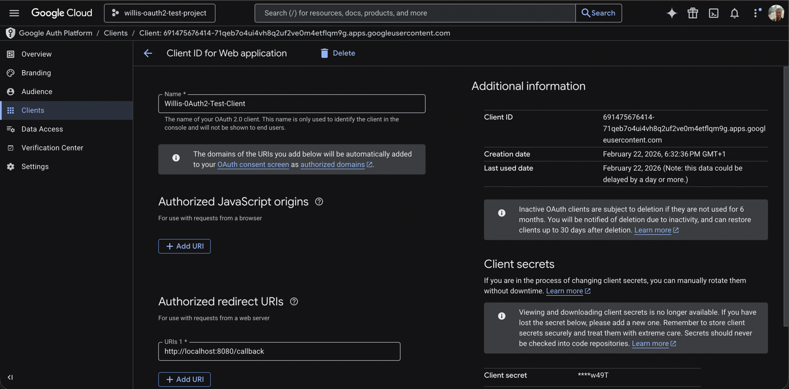

# Hello World with Google SSO

A minimal Go HTTP server with a protected `GET /hello` endpoint that requires authentication via **Google OAuth2 (SSO)**.

Google acts as the Identity Provider (IdP) and the Go server acts as the Service Provider (SP).

---

## How to run

### 1. Create Google OAuth2 Credentials

1. Go to the [Google Cloud Console](https://console.cloud.google.com/).
2. Create a new project (or select an existing one).
3. Navigate to **APIs & Services → Credentials**.
4. Click **Create Credentials → OAuth client ID**.
5. Choose **Web application** as the application type.
6. Under **Authorized redirect URIs**, add:
   ```
   http://localhost:8080/callback
   ```
7. Click **Create** and note down the **Client ID** and **Client Secret**.



---

### 2. Configure Environment Variables

Copy the example env file and fill in your credentials:

| Variable              | Description                                               |
|-----------------------|-----------------------------------------------------------|
| `GOOGLE_CLIENT_ID`    | OAuth2 Client ID from Google Cloud Console                |
| `GOOGLE_CLIENT_SECRET`| OAuth2 Client Secret from Google Cloud Console            |
| `SESSION_SECRET`      | A random secret used to sign session cookies (min 32 chars)|
| `PORT`                | Port the server listens on (default: `8080`)              |

> ⚠️ `.env` is already in `.gitignore` — never commit it.

---

### 3. Run the Server


1. ```sh go mod download```
2. ```sh go run .```
3. Open your browser and navigate to: http://localhost:8080
4. You will be automatically redirected through the following flow:
    ```
    / → /hello → /login → Google consent screen → /callback → /hello ✅
    ```
5. After a successful login, you'll see the **Hello World** page with your Google name and email.

---

## Endpoints

| Method | Path        | Auth required | Description                              |
|--------|-------------|---------------|------------------------------------------|
| GET    | `/`         | No            | Redirects to `/hello`                    |
| GET    | `/hello`    | ✅ Yes        | Returns the Hello World page             |
| GET    | `/login`    | No            | Redirects to Google's consent screen     |
| GET    | `/callback` | No            | Handles the OAuth2 redirect from Google  |
| GET    | `/logout`   | No            | Clears the session and redirects to `/login` |

---

## Project Structure

```
├── main.go              # Entry point: wires up routes and starts the server
├── auth/
│   └── auth.go          # OAuth2 config, session store, IsAuthenticated helper
├── handlers/
│   ├── hello.go         # GET /hello — protected Hello World page
│   ├── login.go         # GET /login — initiates Google OAuth2 flow
│   ├── callback.go      # GET /callback — handles OAuth2 redirect from Google
│   └── logout.go        # GET /logout — clears session
├── middleware/
│   └── auth.go          # RequireAuth middleware for protected routes
...
```

